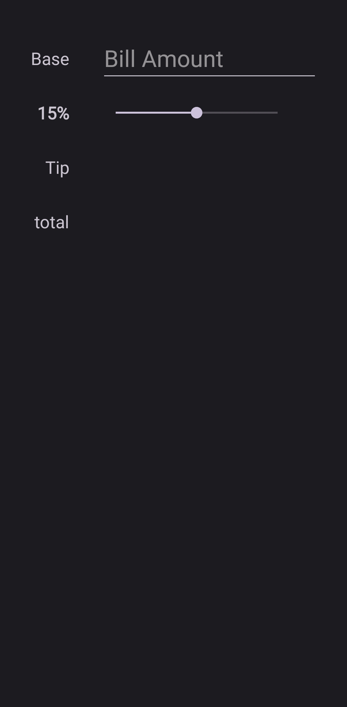
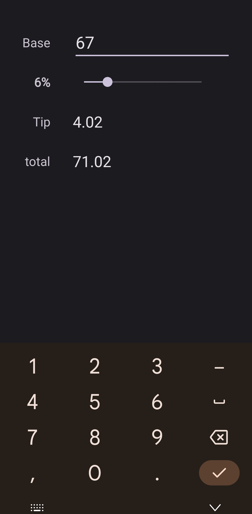
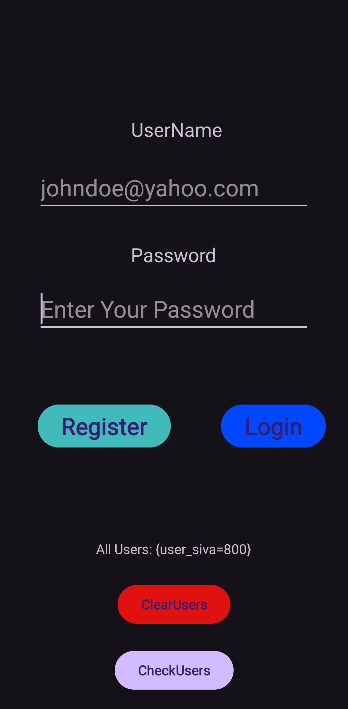
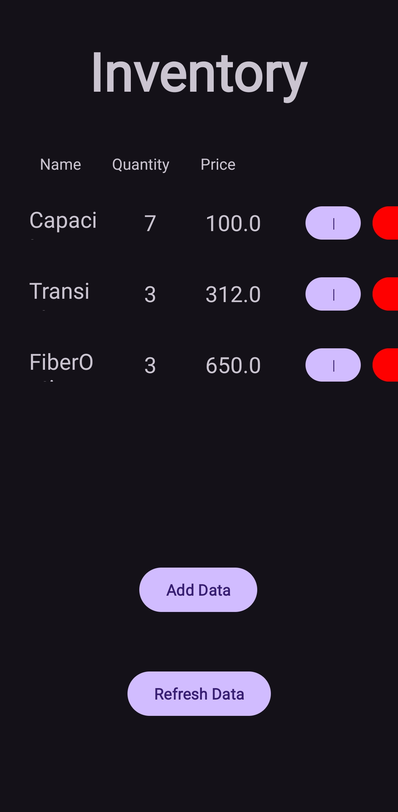
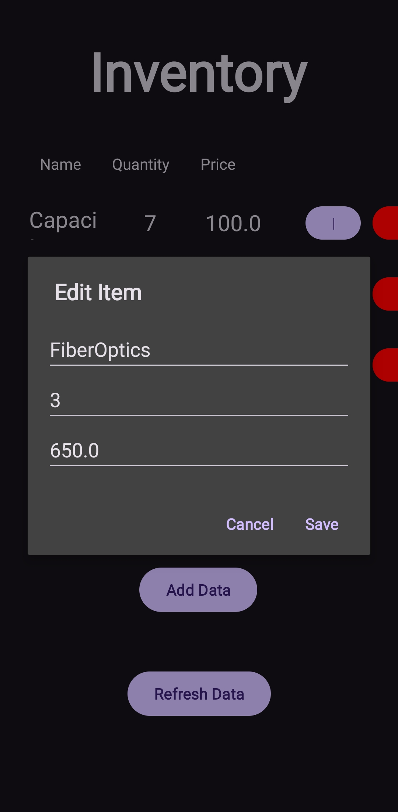
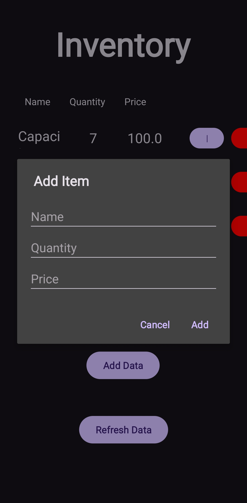

# Kotlin Android Applications

This repository contains multiple Android applications developed in Kotlin. Below is a description of three of the applications included.

---

## 1. TestApp - Tippy

**Tippy** is a simple and intuitive tip calculator app.

### Features

- Enter a base amount (bill value).
- Select a tip percentage using a slider (0% to 30%).
- Instantly see the calculated tip and total amount as you adjust the slider or base value.
- No need for a submit button; calculations update in real time.

### How it works

1. Enter the bill amount in the input field.
2. Adjust the tip percentage using the slider.
3. The app automatically displays the tip amount and the total amount to pay.

### Screenshots

---

## 2. RegisterLogin

**RegisterLogin** is a basic user registration and login demo app.

### Features

- Register new users with a username and password.
- Login with registered credentials.
- User data is stored locally using SharedPreferences.
- Includes options to clear all users and debug view for stored users.

### Screenshots

---

## 3. InventoryManagement

**InventoryManagement** is an inventory tracking app.

### Features

- Add, update, and delete inventory items.
- Each item has a name, quantity, and price.
- Data is managed via integration with a Google Apps Script backend.
- Inventory data is **synced both ways** with a [Google Sheet](https://docs.google.com/spreadsheets/d/1xR-EDDN9sTI-1CLSevPtB9luavjufXro9a2sVI7OSkE/edit?usp=sharing):  
  Any changes made in the app or directly in the sheet are automatically synchronized.
- User-friendly dialogs for editing and saving inventory details.

### Screenshots

---

## Getting Started

Each application is located in its own directory:

- `TestApp/`
- `RegisterLogin/`
- `InventoryManagement/`

To run an app:

1. Open the desired project folder in Android Studio.
2. Build and run the app on an emulator or physical device.

---
